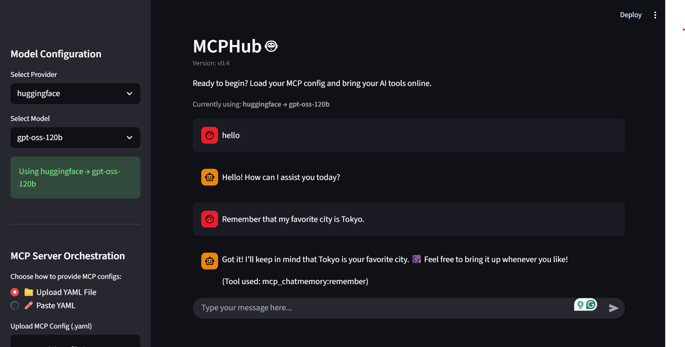

# MCP Hub
A Model-Agnostic Client for Testing and Interacting with MCP Servers 

---

## 💡 Overview  

**MCP Hub** is a lightweight yet powerful system for testing and interacting with **Model Context Protocol (MCP)** servers — without needing any external inspection tools.  

It’s designed to be **model-agnostic**, allowing seamless integration with various LLMs and tools via a simple configuration setup.  

You can test your MCP servers just by uploading a configuration file and interact with them using **natural language** through the frontend.

---

## ⚙️ Features  

- **Model-Agnostic Design** – Plug in any supported LLM (OpenAI, Anthropic, Hugging Face, etc.) without code changes.  

- **Config-Driven Setup** – Just upload your `models_config.yaml` to instantly test your MCP servers.  

- **Tool Invocation** – Call tools like memory, weather, and date handlers with a single message.  

- **LLM Interaction Layer** – Routes requests and responses intelligently across multiple servers.  

- **Simple Frontend** – A Streamlit-based interface to chat with your MCP tools.  

---

## Sample Servers Included
### 🗓️ **mcp_todayinfo**
Provides real-time date and weather lookups.

- **`get_date`** → Returns the current date and time  
- **`get_weather`** → Returns weather data for a specified city  


### 💭 **mcp_chatmemory**
Maintains conversational memory across sessions.

- **`remember`** → Stores user messages or preferences  
- **`recall`** → Retrieves recent memory context *(default: last 5)*  
- **`clear_memory`** → Clears all stored messages  

---

## 🚀 How to Run  

Run both the backend and frontend from the project root:  

```bash
uv run python launch.py
```

This will:
- Start the FastAPI backend on port 8000
- Start the Streamlit frontend on port 8501

You can also run them separately:

```bash
uv run uvicorn backend:app --reload --port 8000
uv run streamlit run frontend.py
```

---


## MCP Server Config  

You can register and test any MCP server by adding it to `_mcp_server_config.yaml` in the root directory.

### Example Config

```yaml
servers:
  - name: mcp_todayinfo
    command: "uv"
    args: ["run", "python", "mcp_todayinfo.py"]

  - name: mcp_chatmemory
    command: "uv"
    args: ["run", "python", "mcp_chatmemory.py"]
```

---


## Vision & Roadmap  

MCP Hub aims to become a **reactive, multi-agent orchestration framework** for MCP servers.  
It currently supports single-tool calls, with plans to expand toward richer, more agentic capabilities.

- **Current:** Single-tool execution and model-agnostic MCP client  
- **Next:** Reactive agent core to enable parallel, multi-tool reasoning  
- **Persistent Vector Memory:** Extend `mcp_chatmemory` for long-term context retention  
- **Multimodal RAG:** Integrate image, text, and audio retrieval capabilities  
- **Observability Dashboard:** Visualize connected servers, tool usage, and reasoning traces  
- **Plugin Framework:** Auto-register and manage external MCP servers dynamically  

---

### Screenshot


---

## 🙋‍♀️ Author
**Divyani Panda**  
_Data Scientist \| Generative AI Engineer_  

[](https://www.linkedin.com/in/divyani-panda-5a8345194/)

